<div align="center">

<a href="https://chiingu.github.io/portfolio">
  
</a>

</div>

<div align="center">

```
┌──────────────────────────────────────────────────────────────────────────┐
│  > BEGIN_LINK_ESTABLISHED - AU-3087H-INST-2                              │
│  > LOG_STREAM_CONNECTED // ID75252N-A698-4D95-A85D-E231A45F13F           │
│  > [MB_IDP] Opened session for user ............ MOURTADA BOUIZAKARNE    │
│  > [ROUTING] CIPHER_NEGOTIATED ===> SHA3(256)@0xAF1B-16A                 │
│  > IDENTITY_VERIFIED ............... CLASS: 1337_Rabat                   │
│  ────────────────────── SYSTEM_OS_READY ──────────────────────           │
└──────────────────────────────────────────────────────────────────────────┘
```

</div>

---

<div align="center">

[](https://chiingu.github.io/portfolio)
[](https://www.linkedin.com/in/mourtada-bouizakarne/)
[](https://1337.ma)

</div>

---

<div align="center">



</div>

<br>

<div align="center">


</div>

<br>

<div align="center">



</div>

---

## `> NETWORK_STATS`

<div align="center">


</div>

<div align="center">


</div>

---

## `> ACTIVITY_LOG`

<div align="center">


</div>

---

<div align="center">

```
┌──────────────────────────────────────────────────────────────────────────┐
│                                                                          │
│   Property of Mourtada. All usage is subject to Central Active          │
│   Monitoring.  MBOUIZAK ver=13.37  v UM6.P                              │
│                                                                          │
│   A0080B119-CF9A-4E8D-A85D-E231A45F13F-00-00-001                        │
│                                                                          │
└──────────────────────────────────────────────────────────────────────────┘
```

[](https://github.com/Chiingu)

</div>
